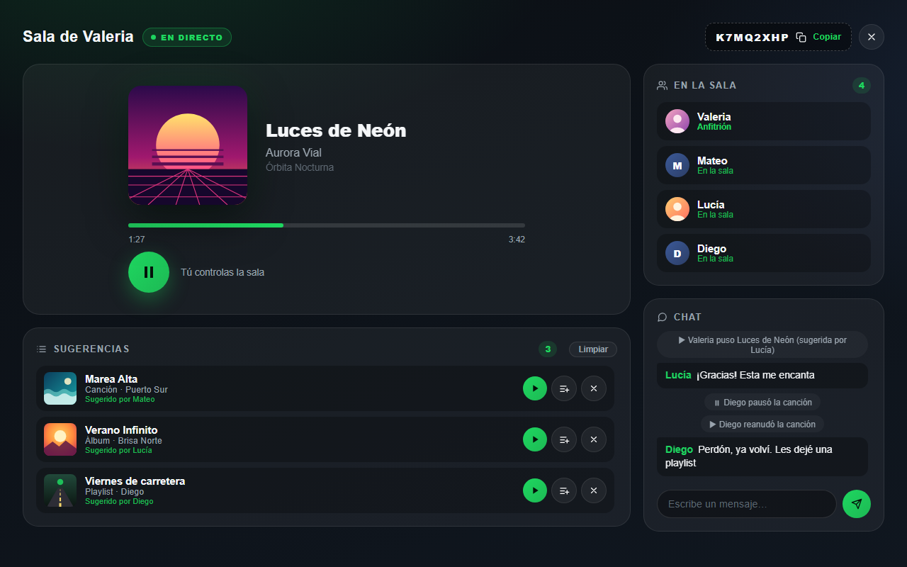

# Spotify Together Rework

App para [Spicetify](https://spicetify.app) que permite escuchar la misma música con amigos en tiempo real desde Spotify de escritorio. La conexión es directa entre computadoras (P2P, con [PeerJS](https://peerjs.com)), sin servidores propios.

> **Basada en [Listen Together](https://github.com/josehtz/spicetify-listen-together), de [josehtz](https://github.com/josehtz)** (licencia MIT). Este proyecto parte de su app y la amplía: los cambios están en [Cambios respecto al original](#cambios-respecto-al-original). Dentro de Spotify la app se sigue llamando **Listen Together**.



## Funciones

- **Salas con código** y contraseña opcional.
- **Sincronización** de canción, posición y pausa, con compensación de latencia.
- **Cualquiera puede pausar o reanudar**, y el chat avisa quién lo hizo. Cambiar o adelantar canciones es solo del anfitrión.
- **Chat** dentro de la sala.
- **Sugerencias:** los invitados proponen canciones, álbumes o playlists (con clic derecho → *Sugerir en Listen Together*, pegando un enlace o arrastrando). El anfitrión decide si las reproduce ahora o las añade a la cola, y puede limpiar la lista.
- **Perfiles:** foto y nombre de Spotify de cada persona; al hacer clic se abre su perfil.
- **Actualización con un clic** desde Spotify cuando hay una versión nueva en este repositorio.
- **Reanudación automática:** si se cierra Spotify estando en una sala, al volver a abrirlo se retoma la misma sala. Los invitados esperan hasta 3 minutos a que el anfitrión vuelva.
- **Botón en la barra superior de Spotify:** se pone verde mientras estás en una sala (ámbar si se está reconectando) y al pulsarlo abre la app.
- **En español o inglés**, según el idioma de Spotify.
- El anfitrión puede expulsar a alguien o pasarle el control de la sala.

## Cambios respecto al original

Esta versión añade:

- **La sala no se pierde al cambiar de pestaña.** La conexión vive en `engine.js`, que se carga al arrancar Spotify, e `index.js` solo dibuja la interfaz.
- **Perfiles de Spotify** en lugar de escribir un nombre: foto y nombre de cada persona, y su perfil al hacer clic.
- **Sincronización más precisa:** compensa la latencia, tolera hasta 1 s de desfase, detecta cuando el anfitrión adelanta la canción y no repite reproducciones.
- **Pausa compartida**, con aviso en el chat.
- **Sugerencias** de canciones, álbumes y playlists, con botones para reproducirlas, añadirlas a la cola o limpiar la lista.
- **Reanudación automática** al reabrir Spotify, sin participantes duplicados.
- **Actualización con un clic**, y aviso de *"Versión antigua de la app"* para quien no actualizó.
- **Seguridad reforzada** y actualizaciones firmadas: ver [Seguridad](#seguridad).
- **Instalador** de un solo comando para Windows, macOS y Linux.
- **Inglés y español**, según el idioma de Spotify.
- **Botón en la barra superior** que se pone verde mientras estás en una sala.

## Requisitos

- Spotify de escritorio con [Spicetify](https://spicetify.app/docs/getting-started) instalado.
- Todas las personas de la sala necesitan esta misma versión.

## Instalación

Necesitas [Spicetify](https://spicetify.app/docs/getting-started) instalado. Las apps de Spicetify no se instalan desde el Marketplace (su botón abre este repositorio), pero el instalador lo hace en un paso.

### Con el instalador

**Windows:** abre PowerShell (búscalo en el menú Inicio, sin "Ejecutar como administrador") y pega:

```powershell
iwr -useb https://raw.githubusercontent.com/Corsixs/spicetify-listen-together/main/install.ps1 | iex
```

**macOS y Linux:** en una terminal:

```bash
curl -fsSL https://raw.githubusercontent.com/Corsixs/spicetify-listen-together/main/install.sh | sh
```

El instalador descarga la última versión de este repositorio, la copia en la carpeta `CustomApps` de Spicetify, la activa y ejecuta `spicetify apply`, que reinicia Spotify. Si estabas en una sala, vuelves a entrar sola. Sirve también para actualizar o reparar la instalación, y no toca nada más. Puedes leer lo que hace en [`install.ps1`](install.ps1) e [`install.sh`](install.sh).

Al terminar, en Spotify aparece **Listen Together**, con el icono de una nota musical.

### A mano

1. Pulsa `Win + R`, escribe `%APPDATA%\spicetify\CustomApps` y pulsa Enter.

   En macOS y Linux, `spicetify path userdata` muestra la carpeta de Spicetify; las apps van en su subcarpeta `CustomApps`.
2. Copia ahí la carpeta [`listen-together`](listen-together) de este repositorio. Si ya existía (una versión anterior o el Listen Together original), reemplázala entera.

   Debe quedar así: `CustomApps\listen-together\engine.js`, `index.js`, `manifest.json`, `peerjs.bundle.js` y `style.css`.
3. Abre una terminal y ejecuta:

   ```bash
   spicetify config custom_apps listen-together
   ```

   Este primer comando solo hace falta la primera vez.

   ```bash
   spicetify apply
   ```

4. En Spotify aparece **Listen Together**, con el icono de una nota musical.

## Actualizar

**Desde Spotify (versión 7 o posterior):** cuando hay una versión nueva en este repositorio, Listen Together muestra el aviso *"Hay una versión nueva de Listen Together"*. Al pulsar **Actualizar**, descarga la versión nueva de este repositorio y recarga Spotify. Si estabas en una sala, vuelves a entrar automáticamente.

- Solo descarga de este repositorio, por HTTPS, y nunca sin que pulses el botón.
- Desde la versión 8, solo instala versiones con una firma digital válida (ver [Seguridad](#seguridad)).
- Si la versión descargada falla al arrancar, se descarta sola y vuelve la que tenías instalada. Si falla la pantalla, aparece un botón *"Volver a la versión instalada"*.

**Con el instalador o a mano:** vuelve a ejecutar el instalador, o reemplaza la carpeta `listen-together` con la nueva versión y ejecuta `spicetify apply`. También sirve si vienes de una versión anterior a la 7, que no tiene el botón.

Si alguien de la sala tiene una versión vieja, debajo de su nombre aparece *"Versión antigua de la app"*.

### Para quien mantiene el repositorio

Para publicar una versión nueva:

1. Sube el mismo número en los tres sitios: `var BUILD` y `const APP_VERSION` en `engine.js`, y `const UI_BUILD` en `index.js`.
2. Firma la versión con `node tools/firmar-version.mjs "Qué cambió"`. Comprueba que los tres números coincidan y escribe [`version.json`](version.json) con los SHA-256 de `engine.js`, `index.js` y `style.css` y una firma de todo eso.
3. Haz commit y push. El botón **Actualizar** solo instala la versión si la firma es válida y cada archivo descargado es exactamente el firmado.

La clave privada está en `%USERPROFILE%\.spotify-together\clave-actualizaciones.pem`, fuera del repositorio. Guarda una copia de seguridad en un lugar privado: sin ella no se pueden publicar actualizaciones por el botón, y habría que crear otra clave y que todos reinstalaran con el instalador.

## Seguridad

- Todo lo que llega de otras personas (nombres, chat, sugerencias, fotos y estado de la canción) se valida y se recorta antes de guardarlo o mostrarlo. Un mensaje mal formado no puede romper la pantalla de nadie.
- Las fotos y portadas solo se cargan de los servidores de imágenes de Spotify y de las fotos de perfil de Facebook y Google. Así nadie puede usar una imagen para ver la IP de los demás.
- El anfitrión busca él mismo el nombre y la portada de cada sugerencia: lo que ves en la lista es lo que suena.
- Los invitados solo siguen canciones y episodios; nunca anuncios, archivos locales ni otras direcciones.
- Hay límites contra el spam en el chat, las sugerencias y los avisos, y un máximo de 20 personas por sala. Las conexiones que no se identifican en 15 segundos se cierran.
- Tras 5 contraseñas incorrectas en un minuto, la sala deja de aceptar gente nueva durante un minuto.
- Las actualizaciones del botón **Actualizar** van firmadas con una clave que no está en GitHub: aunque alguien entrara a la cuenta, no podría publicar una actualización que la app acepte.

Lo que no cubre:

- El código de la sala es la llave. Quien lo tenga puede entrar (o intentarlo, si hay contraseña), así que compártelo solo con gente de confianza.
- Como la conexión es directa, el anfitrión ve la IP de cada invitado y cada invitado la del anfitrión.
- El instalador y la instalación a mano confían en lo que haya en este repositorio en ese momento.

## Notas

- La conexión entre computadoras se establece a través del servidor público gratuito de PeerJS y de servidores STUN de Google. Después, la sincronización y el chat viajan directamente de una computadora a otra. La música no se transmite: cada persona la escucha desde su propio Spotify.
- Algunas redes muy restrictivas (por ejemplo, ciertos datos móviles) pueden bloquear la conexión directa.
- La contraseña de la sala nunca se envía ni se guarda tal cual: solo se usa un código derivado de ella.

## Créditos

- [Listen Together](https://github.com/josehtz/spicetify-listen-together), de [josehtz](https://github.com/josehtz) (licencia MIT): la app original en la que se basa este proyecto.
- [PeerJS](https://github.com/peers/peerjs) (licencia MIT): ver [THIRD_PARTY_NOTICES.md](THIRD_PARTY_NOTICES.md).

## Licencia

[MIT](LICENSE). Incluye el aviso de copyright de josehtz, autor de Listen Together, y el de este rework. PeerJS se distribuye con su propia licencia MIT: ver [THIRD_PARTY_NOTICES.md](THIRD_PARTY_NOTICES.md).
